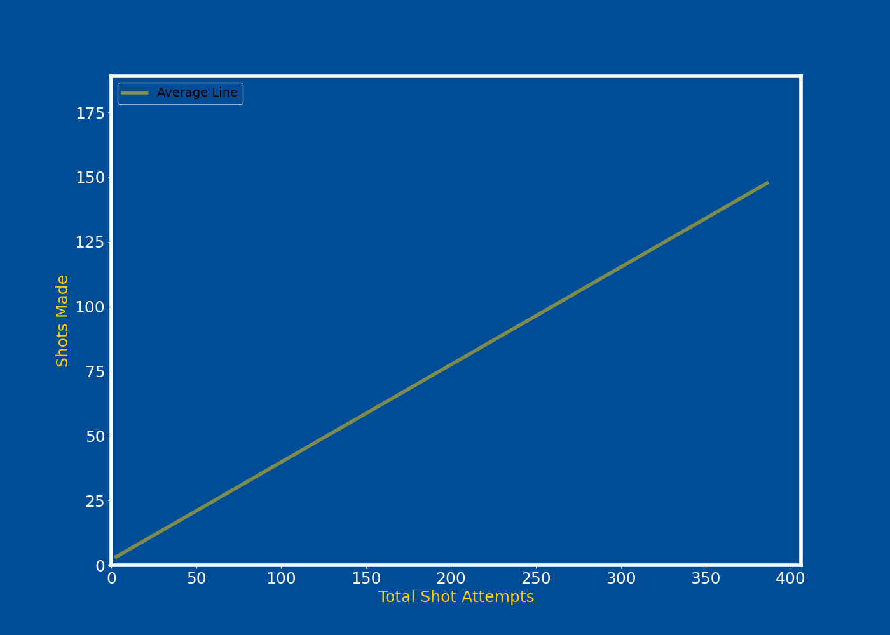

🏀 basket-viz
==============================

A Python library for creating interactive and customizable visualizations of basketball statistics.


# ⛹️‍♂️ Getting Started 


## ♻️  Installation

To install basket-viz, simply run:

```bash
pip install basket-viz
```

⭐️⭐️⭐️ Leave a star on [GitHub](https://github.com/sVujke/basket-viz/tree/main)

# Features 

## 🎯 Shot Charts 

Visualize the court and field goals made by players or teams. Generate `static` and `animated` plots. Customize the visual elements or utilize the included `Euroleague confings`.

For more details read: 

-  [Static Shot Chart - Scatter ](shot_charts/static_scatter.md)
-  [Animated Shot Chart - Scatter](shot_charts/animated_scatter.md)
-  [Euroleague Shot Chart - Scatter](shot_charts/euroleague_scatter.md)


```python
from basket_viz.court.shot_charts import ShotChart

shot_chart = ShotChart()
shot_chart.plot_shot_chart(df, player_name="SHANE, LARKIN")
```


## 🎢 Overlay 
Plot `static` and `animated` overlay comparing the performance of individuals or teams against the rest of the league over a chosen trajectory (distance from the basket, quarters of the game). 

For more details read: 

-  [Static Trajectory](overlay/static-animated.md)
-  [Animated Trajectory](overlay/trajectory-animated.md)

```python
from basket_viz.overlay.trajectory import PlotTrajectory

pt = PlotTrajectory()

players = ["Hezonja, Mario","James, Mike","Lessort, Mathias"]
colors = [real_madrid_gold, monaco_red, panathenaicos_green]
v_lines = {1.0: 'Short-Range', 4.0: 'Mid-Range', 6.75: 'Three-Point Line'}

pt.plot_trajectory_animated(normalized_df, players, colors, v_lines=v_lines, title=f"Scoring Profiles \n EUROLEAGUE 23/24")
```


## 📈 Relationships 

Plot relationships between different stats of players of a team. 

To apply collor template that matches the brand of `Euroleague` teams use `use_team_config=True`. 

```python
from basket_viz.relationships.plotter import PlotRelationship

plotter = PlotRelationship(use_team_config=True,output_format='mp4')
plotter.plot_animated_relationship(
    df,
    team_filter="BAR",
    display_only_last_names=True,
)
```

