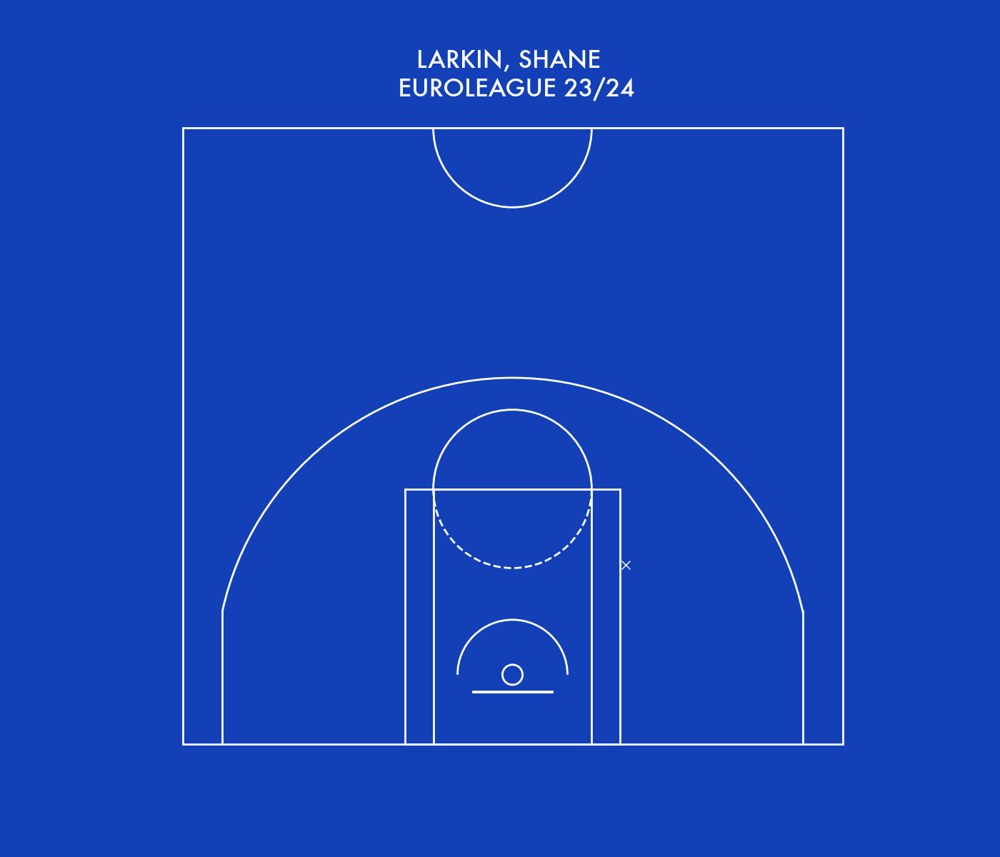

# Euroleague Scatter - Shot Chart

The `euroleague_field_goal_dots` method in the `ShotChart` class serves as a wrapper that simplifies the visualization of field goal attempts using data from the Euroleague API. This method provides a convenient plug-and-play solution for creating detailed shot charts tailored to Euroleague players or teams.

This function leverages the `team_configs` from the `basket_viz.court.euroleague_team_configs` module to color the plots according to team branding. The team codes used in these configurations match the ones in the Euroleague API, making it straightforward to apply team-specific styles.

## Function: `euroleague_field_goal_dots`

### Description

The `euroleague_field_goal_dots` function is designed to seamlessly integrate with the Euroleague API, allowing users to generate visualizations of field goal attempts with minimal setup. By leveraging this function, users can create both static and temporal scatter plots that illustrate the shooting performance of a specified player or team during a game or across multiple games.

### Parameters

- `df` (DataFrame): The DataFrame containing shot data.
- `player_name` (str, optional): The name of the player to visualize. Defaults to `None`.
- `team_name` (str, optional): The name of the team to visualize. Defaults to `None`.
- `game_id` (str, optional): The ID of the game to visualize. Defaults to `None`.
- `temporal` (bool, optional): If `True`, creates a temporal animation of shots over time. If `False`, creates a static scatter plot. Defaults to `False`.
- `title` (str, optional): The title of the plot. Defaults to `None`.

### Example Usage - Static

```python
import pandas as pd
from basket_viz.court.shot_charts import ShotChart  
from basket_viz.court.euroleague_team_configs import team_configs

# load data from Euroleague API 
df = pd.DataFrame(data)

# Create ShotChart instance with Barcelona team configuration
team_config = team_configs['BAR']
shot_chart = ShotChart(config=team_config)

# Visualize Rubio's shots in Euroleague 23/24 season
player_name = "Rubio, Ricky".upper()
shot_chart.euroleague_field_goal_dots(
    df,
    player_name=player_name,
    game_id=None,
    temporal=False,
    title=f"{player_name} \n EUROLEAGUE 23/24"
)

```


```python
import pandas as pd
from basket_viz.court.shot_charts import ShotChart  
from basket_viz.court.euroleague_team_configs import team_configs

# load euroleague api data 
df = pd.DataFrame(data)

# Create ShotChart instance with Virtus Bologna team configuration
team_config = team_configs['VIR']
shot_chart = ShotChart(config=team_config)

# Visualize Shengelia's shots in Euroleague 23/24 season
player_name = "Shengelia, Tornike".upper()
shot_chart.euroleague_field_goal_dots(
    df,
    player_name=player_name,
    game_id=None,
    temporal=False,
    title=f"{player_name} \n EUROLEAGUE 23/24"
)

```


```python
import pandas as pd
from basket_viz.court.shot_charts import ShotChart  
from basket_viz.court.euroleague_team_configs import team_configs

# load euroleague api data 
df = pd.DataFrame(data)

# Create ShotChart instance with Panathenaikos team configuration
team_config = team_configs['PAN']
shot_chart = ShotChart(config=team_config)

# Visualize Nunn's shots in Euroleague 23/24 season
player_name = "Nunn, Kendrick".upper()
shot_chart.euroleague_field_goal_dots(
    df,
    player_name=player_name,
    game_id=None,
    temporal=False,
    title=f"{player_name} \n EUROLEAGUE 23/24"
)

```


### Example Usage - Animated

The primary distinction between generating an animated plot and a static plot lies in the adjustment of a single parameter, `temporal=True`.

```python
import pandas as pd
from basket_viz.court.shot_charts import ShotChart  
from basket_viz.court.euroleague_team_configs import team_configs

# load euroleague api data 
df = pd.DataFrame(data)

# Create ShotChart instance with Efes team configuration
team_config = team_configs['IST']
shot_chart = ShotChart(config=team_config)

# Visualize Larkin's shots in Euroleague 23/24 season
player_name = "Larkin, Shane".upper()
shot_chart.euroleague_field_goal_dots(
    df,
    player_name=player_name,
    game_id=None,
    temporal=True,
    title=f"{player_name} \n EUROLEAGUE 23/24"
)

```




```python
import pandas as pd
from basket_viz.court.shot_charts import ShotChart  
from basket_viz.court.euroleague_team_configs import team_configs

# load euroleague api data 
df = pd.DataFrame(data)

# Create ShotChart instance with Crvena Zvezda team configuration
team_config = team_configs['RED']
shot_chart = ShotChart(config=team_config)

# Visualize Teodosic's shots in Euroleague 23/24 season
player_name = "Teodosic, Milos".upper()
shot_chart.euroleague_field_goal_dots(
    df_23,
    player_name=player_name,
    game_id=None,
    temporal=True,
    title=f"{player_name} \n EUROLEAGUE 23/24"

```

